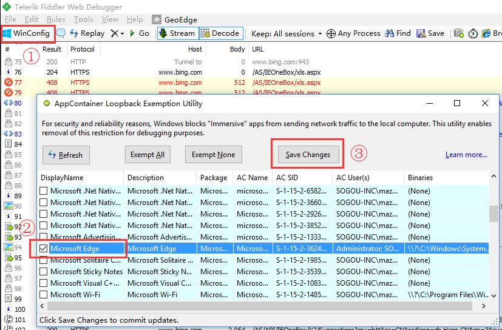

# awesome-fiddler

Fiddler Usage Complete / Q&amp;A

## Q & A

### How to working with Microsoft Edge?

1. Make sure you installed **Fiddler 4**.

2. Click Menu, Tools > Win8 Loopback Exemptions.

    *Alternatively, you can click "WinConfig" button in Fiddler toolbar if has.*

3. In the popup dialog "AppContainer Loopback Exemption Utility", find "Microsoft Edge", check it and click "Save Changes".

Done!

